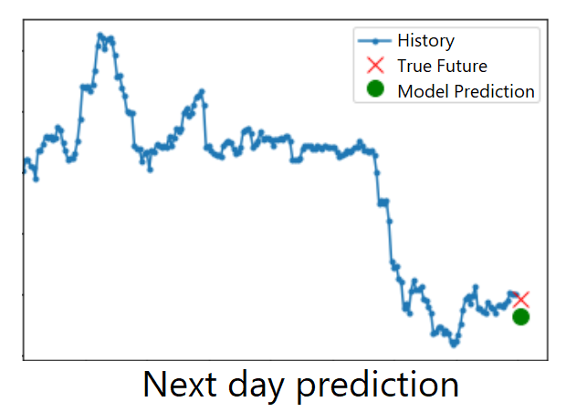

# Cryptocurrency price prediction with recurring network
 
The value of a cryptocurrency, as well as an active functioning of the stock market, can be configured with a time series. Here, we consider the weighted value of Bitcoin's daily price to construct our series. The purpose of this study is to predict the next value, based on the latest cryptocurrency values. Thus, I will use LSTM network, as they have memory, which is important when dealing with sequential data.
 

Data  : [Click here to download data](https://www.kaggle.com/code/jonathansilva2020/bitcoin-historical-data-rnn-lstm/data)

